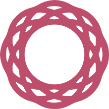
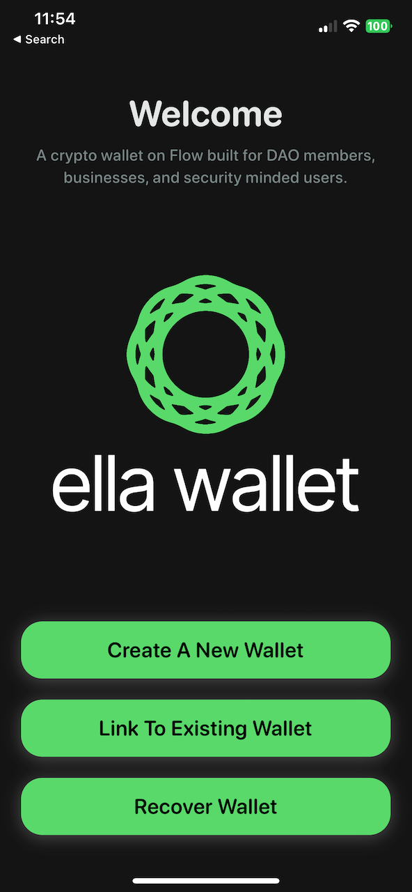
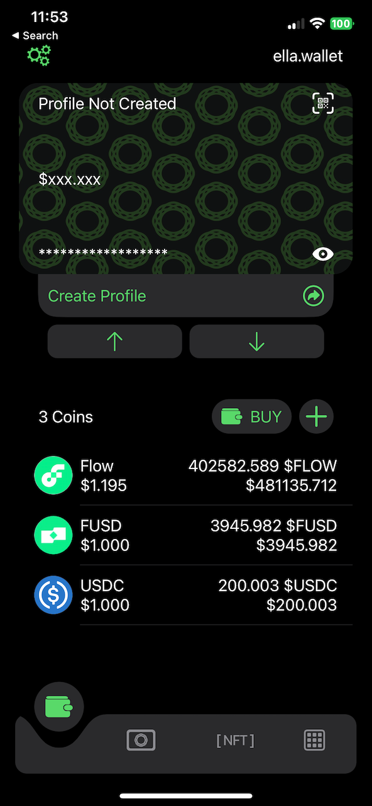
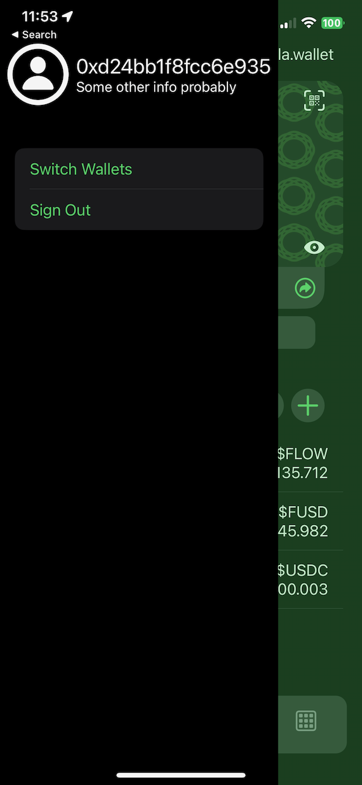
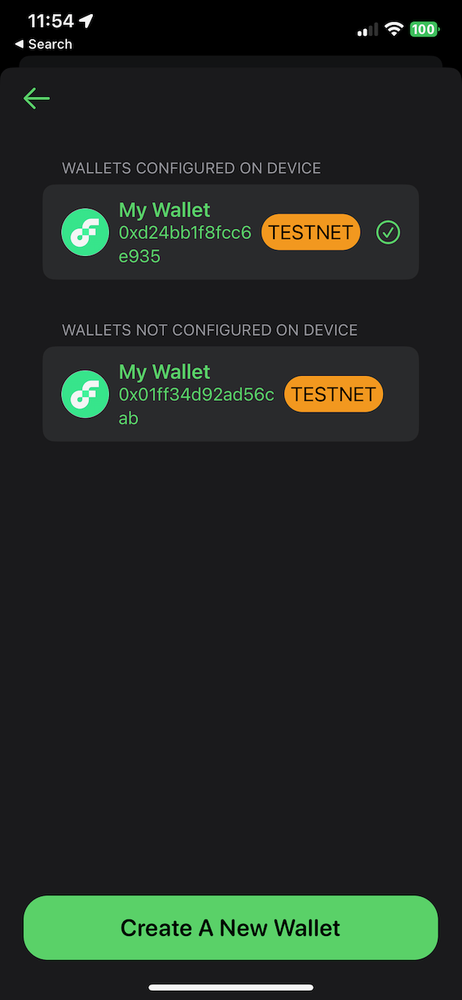
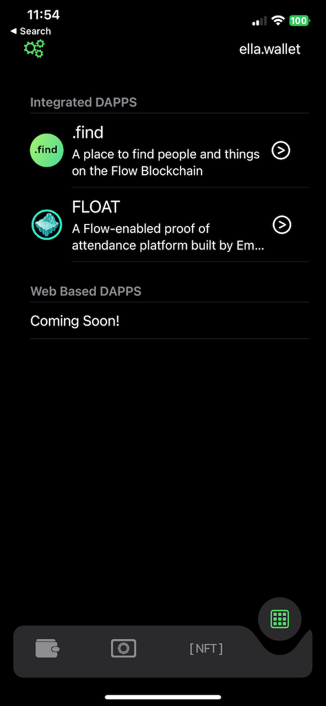

<!-- Improved compatibility of back to top link: See: https://github.com/othneildrew/Best-README-Template/pull/73 -->

<!--
*** Thanks for checking out the Best-README-Template. If you have a suggestion
*** that would make this better, please fork the repo and create a pull request
*** or simply open an issue with the tag "enhancement".
*** Don't forget to give the project a star!
*** Thanks again! Now go create something AMAZING! :D
-->

<!-- PROJECT SHIELDS -->
<!--
*** I'm using markdown "reference style" links for readability.
*** Reference links are enclosed in brackets [ ] instead of parentheses ( ).
*** See the bottom of this document for the declaration of the reference variables
*** for contributors-url, forks-url, etc. This is an optional, concise syntax you may use.
*** https://www.markdownguide.org/basic-syntax/#reference-style-links
-->

[![Contributors][contributors-shield]][contributors-url]
[![Forks][forks-shield]][forks-url]
[![Stargazers][stars-shield]][stars-url]
[![Issues][issues-shield]][issues-url]
[![MIT License][license-shield]][license-url]
[![Discord][discord-shield]][discord-url]

<!-- PROJECT LOGO -->
 

  

<h3 align="center">ella.wallet</h3>

  

    A wallet built on the Flow Blockchain focused on everyday usage of crypto, DAO Membership, and bankless individuals
     
    <a href="https://github.com/ella-codes-dao/ella.wallet"><strong>Explore the docs »</strong></a>
     
     
    <a href="https://github.com/ella-codes-dao/ella.wallet">View Demo</a>
    ·
    <a href="https://github.com/ella-codes-dao/ella.wallet/issues">Report Bug</a>
    ·
    <a href="https://github.com/ella-codes-dao/ella.wallet/issues">Request Feature</a>
  

<!-- ABOUT THE PROJECT -->

## About The Project

ella.wallet is a blockchain wallet that prioritizes device security while supporting cross-chain transactions. Its multi-device privacy feature ensures you have full control over your assets, even if you manage your cryptocurrency portfolio on multiple devices.

Built on the Flow blockchain, ella.wallet is designed to meet the needs of DAO members, offering features tailored to their requirements. This includes the ability to easily vote on proposals, participate in governance decisions, and manage DAO tokens.

For individuals without access to banking services, ella.wallet provides an excellent solution to access and manage cryptocurrencies without relying on traditional banking institutions. This is especially beneficial for those living in areas with limited access to banking services or for those seeking to keep their financial transactions private and secure.

(<a href="#readme-top">back to top</a>)

<!-- USAGE EXAMPLES -->

## Usage

At ella.wallet, we understand that security should be both easy to use and easy to comprehend. For this reason, we have designed our wallet with a focus on everyday usage, while still ensuring that your assets are always secure.

Our wallet uses a multi-key system, that starts with a recovery key, this key is the only key with a weight of 1000, and is never stored on your device. Next, we create account and device keys with equal weights of 500.

This means that if you need to remove a device from your wallet, you can do so easily without compromising the security of your assets. Additionally, access to your wallet requires both the device and account keys, adding an extra layer of protection to keep your assets safe and secure.This eliminates the need for a recovery key to be stored on any device, which helps to improve the overall security of your assets.

If you lose a device or your account key is compromised, our recovery process is simple. You will need both the original recovery phrase and a password you created to regain access to your assets, ensuring that they remain secure at all times.

ella.wallet has a unique “bankless bank feature” called ella.card which manages digital assets without relying on a traditional bank account. With this feature, users can store and manage digital assets, such as USDC, and use them as a funding source for the upcoming Ella Card, which is not a traditional credit card as there is no traditional bank account involved.

The ella.card accessed through the app utilizes the new authentication account capabilities on the Flow Blockchain to authorize transactions and provide users with a credit-like experience, but without the risk of accumulating debt. To ensure that the transaction clears, we need to verify that we have the capability and that the end-point user has sufficient funds available. When a purchase is made, the app immediately fronts the required funds, but the transaction is promptly settled through a blockchain transaction that pulls the necessary funds from the user's wallet to repay the fronted amount. If, for any reason, the capability is removed or an earlier transaction fails to process, the ella.card is temporarily disabled until the issue is resolved.

[ Hackathon Update - We were unable to complete the smart contracts for ella.card and will submit/launch ella.card specifically during the next hackathon, ella.card data in app is currently simulated ]

(<a href="#readme-top">back to top</a>)

<!-- ROADMAP -->

## Roadmap

- [x] Wallet creation using recovery key and account/devices keys
- [x] Account recovery using recovery key
- [ ] Wallet Connect integration (FCL Auth/Sign Transactions)
- [x] Ability to remove account/device keys from wallet allowing for multi device control access control
- [ ] USDC "Bridge" Accounts (Integration with the Circle APIs to allow for cross bridge sending and receiving of USDC)
- [x] NFT Catalog Integration
- [x] Multiple Wallet Support (allow each device/app to support multiple wallets simultaneously)
- [ ] ella.card (US/EU card program linked to USDC Bridge account)

See the [open issues](https://github.com/ella-codes-dao/ella.wallet/issues) for a full list of proposed features (and known issues).

(<a href="#readme-top">back to top</a>)

## Screenshots

  

  

  

  

  

<!-- CONTRIBUTING -->

## Contributing

At ella.wallet, we are committed to building a robust community of users and developers who are passionate about cryptocurrency and the potential of blockchain technology. We believe that collaboration is essential to creating innovative solutions that meet the needs of our users. That's why we welcome contributions from all community members.

If you're interested in contributing to the development of ella.wallet, we encourage you to join our dedicated Discord channel for community members and developers. This channel is an open space for sharing ideas, collaborating on projects, and discussing the latest developments in the world of cryptocurrency.

As a community-driven project, we value the input and feedback of our users. Whether you have a suggestion for a new feature, need to report a bug, or want to share your thoughts on how we can improve the user experience, we want to hear from you! Our Discord channel is the perfect place to connect with other community members and share your ideas with the ella.wallet development team.

We're dedicated to creating a welcoming and inclusive community that fosters collaboration and creativity. Whether you're an experienced developer or simply passionate about cryptocurrency, we welcome your contributions and look forward to working together to build the future of blockchain technology.

(<a href="#readme-top">back to top</a>)

## TLDR

ella.wallet is a secure and user-friendly blockchain wallet with cross-chain transaction support, built on the scalable Flow blockchain. It offers tailored features for DAO members, a multi-key system, and a simple recovery process. Additionally, it provides a "bankless bank account" for managing digital assets without relying on traditional bank accounts. The upcoming Ella.Card offers a credit-like experience without the risk of debt accumulation. Contributions are welcome through the Discord channel.

<!-- LICENSE -->

## License

Distributed under the ELV2 License. See `LICENSE.txt` for more information.

(<a href="#readme-top">back to top</a>)

<!-- CONTACT -->

## Contact

- Brian Pistone - Lead Developer - brian@ella.holdings
- Ashton Mercer - Development - ashton@ella.holdings
- Andrew Van Dyke - Development - andrew@ella.holdings

Project Link: [https://github.com/ella-codes-dao/ella.wallet](https://github.com/ella-codes-dao/ella.wallet)

(<a href="#readme-top">back to top</a>)

<!-- MARKDOWN LINKS & IMAGES -->
<!-- https://www.markdownguide.org/basic-syntax/#reference-style-links -->

[contributors-shield]: https://img.shields.io/github/contributors/ella-codes-dao/ella.wallet.svg?style=for-the-badge
[contributors-url]: https://github.com/ella-codes-dao/ella.wallet/graphs/contributors
[forks-shield]: https://img.shields.io/github/forks/ella-codes-dao/ella.wallet.svg?style=for-the-badge
[forks-url]: https://github.com/ella-codes-dao/ella.wallet/network/members
[stars-shield]: https://img.shields.io/github/stars/ella-codes-dao/ella.wallet.svg?style=for-the-badge
[stars-url]: https://github.com/ella-codes-dao/ella.wallet/stargazers
[issues-shield]: https://img.shields.io/github/issues/ella-codes-dao/ella.wallet.svg?style=for-the-badge
[issues-url]: https://github.com/ella-codes-dao/ella.wallet/issues
[license-shield]: https://img.shields.io/badge/License-ELv2-blue.svg?style=for-the-badge
[license-url]: https://github.com/ella-codes-dao/ella.wallet/blob/master/LICENSE.txt
[discord-shield]: https://img.shields.io/discord/123456789?style=for-the-badge
[discord-url]: https://linkedin.com/in/linkedin_username
[product-screenshot]: images/screenshot.png
[react.js]: https://img.shields.io/badge/React-20232A?style=for-the-badge&logo=react&logoColor=61DAFB
[react-url]: https://reactjs.org/
[vue.js]: https://img.shields.io/badge/Vue.js-35495E?style=for-the-badge&logo=vuedotjs&logoColor=4FC08D
[vue-url]: https://vuejs.org/
[angular.io]: https://img.shields.io/badge/Angular-DD0031?style=for-the-badge&logo=angular&logoColor=white
[angular-url]: https://angular.io/
[svelte.dev]: https://img.shields.io/badge/Svelte-4A4A55?style=for-the-badge&logo=svelte&logoColor=FF3E00
[svelte-url]: https://svelte.dev/
[laravel.com]: https://img.shields.io/badge/Laravel-FF2D20?style=for-the-badge&logo=laravel&logoColor=white
[laravel-url]: https://laravel.com
[bootstrap.com]: https://img.shields.io/badge/Bootstrap-563D7C?style=for-the-badge&logo=bootstrap&logoColor=white
[bootstrap-url]: https://getbootstrap.com
[jquery.com]: https://img.shields.io/badge/jQuery-0769AD?style=for-the-badge&logo=jquery&logoColor=white
[jquery-url]: https://jquery.com
